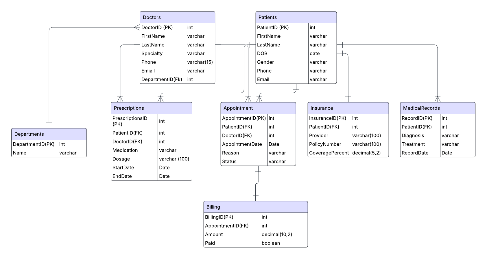

# 🏥 Healthcare Management System (SQL Project)

A complete SQL-based data system simulating a real-world healthcare management workflow. This project demonstrates relational design, data normalization, and analytical queries suitable for Data Analyst and Data Engineer roles.

---

## 💼 About the Project

This system is designed to store and analyze healthcare data involving patients, doctors, departments, appointments, medical records, prescriptions, insurance, and billing.

It showcases practical SQL skills including:
- Data modeling
- Relationship mapping
- Query logic
- Real-world data analysis

---

## 📁 Files Included

| File           | Description                                         |
|----------------|-----------------------------------------------------|
| `schema.sql`   | Defines all database tables and foreign key links   |
| `data.sql`     | Inserts realistic sample data for demo and testing  |
| `queries.sql`  | Includes SELECT, JOIN, GROUP BY, and subqueries     |
| `README.md`    | Project documentation and usage instructions        |
| `ERD.png`      | Visual entity relationship diagram (created in Lucidchart) |

---

## 🧠 Key SQL Concepts Used

- Relational database design & normalization (3NF)
- `PRIMARY KEY` and `FOREIGN KEY` constraints
- `JOIN`s across multiple tables
- Aggregate functions with `GROUP BY`
- Subqueries for nested analysis
- `CASE` statements for readable outputs
- One-to-many and one-to-one relationship mapping

---

## ✅ How to Run

1. Open MySQL (or any compatible SQL database).
2. Execute `schema.sql` to create tables.
3. Run `data.sql` to populate test records.
4. Explore reports and analysis using `queries.sql`.

---

## 🧰 Tools Used

- **SQL** (Tested on MySQL)
- **Lucidchart** – for visual ERD creation

---

## 📊 ERD

---

## 🔖 Tags

`SQL` `Healthcare Data` `Database Design` `Data Analyst Project` `MySQL` `Lucidchart` `Relational Database`

